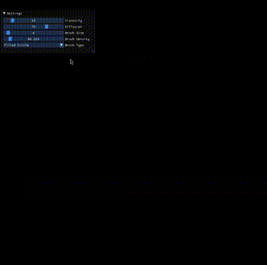

<div align="center">
    <h1>
        Fluidrs
    </h1>
    <h6>An Eulerian fluid simulator</h6>
    
    <br>
    


</div>

---

Fluidrs is a simple fluid simulator written in Rust with raylib and imgui. This project was created for educational purposes and to learn more about fluid simulation.

## Features

- 2D fluid simulation
- Ability to change fluid and simulation parameters live with ImGui
- Enjoy the beauty of playing with fluids

## Installation

Just clone the repository and build the program (preferably in release mode):

```bash
git clone git@github.com:MiliAxe/fluidrs.git
```

```bash
cargo run --release
```

#### Note
You might need to change the Deltatime `DT` in the `src/config.rs` file to get the best performance on your machine.

## Usage

- Left click to add fluid
- Hold right click to add velocity in the mouse direction

## Credits

Thanks to [Mike Ash's](https://mikeash.com/pyblog/fluid-simulation-for-dummies.html) blog post for the great explanation of fluid simulation. Most of the calculation is based on his explanation.
